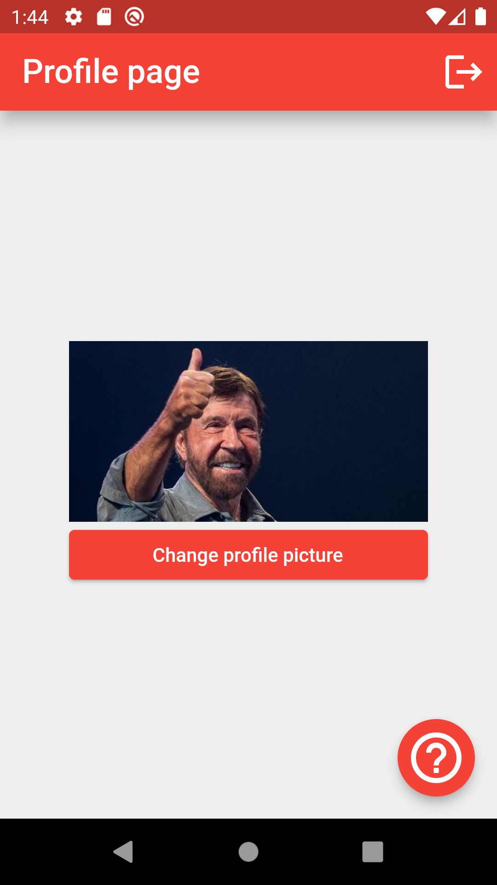

# Exercise E4

Repository for exercise E4.
Course [IDATA2503 Mobile applications](https://www.ntnu.edu/studies/courses/IDATA2503)
at [NTNU](https://ntnu.edu), campus [Aalesund](https://www.ntnu.edu/alesund).

## Intention

The intention in this exercise is to practice different aspects of creating UI layouts:

* Customizing the AppBar:
    * Adding actions
    * Setting elevation
* Changing the default theme-color
* Using an image
* Changing font sizes
* Removing the "Debug" label
* Setting onPress callbacks for buttons

It is totally OK (and expected) that for many steps you will need to search on the web, Google and
Stack Overflow will be your friends.

As a side-effect - the things you try here could be your "notebook". When you need some of the
concepts from this exercises later in your project(s), you know that you have an example to look at.

## Hand-in process

Create a clone of the template repository within GitHub Classroom. Use the invitation link you got
from Blackboard! Get the automated tests passing.

One thing that is new here - we use Flutter testing with a golden image. This means that your
solution must correspond to the reference image 100%. This should be relatively easy to do - the
default flutter config (paddings, font sizes) should be the same for everyone.

To run the test locally, execute the following command in a terminal: `flutter test`. If the UI of
your solution will differ from the reference image, check out the files generated
inside `test/screenshot-tests/failures`. There you will see the original image, your image and the
differences marked.

There is another unit tests, which checks the functionality (whether the on-click handlers are set
correctly). This test is also included in the auto-grading script.

## Instructions

Open the provided Flutter application and extend it. The app itself is a stateful-widget (don't
worry much about it now). To build the UI, implement the `build` method inside
the `_MyHomePageState` class.

The app must contain a single page which looks as this _reference image_:

In addition to the visual representation, you must also set on-tap handlers for the three buttons:
* The Sign-out button in the app bar must call the `_signOut` method.
* The "Change profile picture" must call `_changePicture` method.
* The "?" button must call `_showHelp` method.

### Hints

Here is what the app must contain:

1. The main color (for the theme) must be `Colors.red`.
2. You need to remove the label saying "Debug" on the top-right corner.
3. You need an `AppBar` with the text "Profile picture", with font size 24px.
4. The app bar must be "elevated above the background" - 10px high.
5. The background for the main app-region has the color `Grey[200]`.
6. There must be a "Sign out" action in the app bar, an `IconButton` with the `Icons.logout` as the
   icon, size: 32px.
    1. When it is pressed, call the `_signOut` method. This will be tested in another unit-test, the
       golden-image does not check this part.
7. An image and a button, centered vertically:
    1. The image file is located the folder `images`
    2. The button has the text "Change profile picture"
    3. Both the image and button have 50px padding on the sides.
    4. When the button is pressed, the `_changePicture` method must be called
8. On the bottom right there must be a floating action button with the `Icons.help_outline` icon,
   size: 44px.
    1. When this button is clicked, `_showHelp` method must be called.

## Image source

The profile picture used in this application is copied from the
article [Aker saves the Earth, with a little help from Chuck Norris](https://www.upstreamonline.com/energy-transition/aker-saves-the-earth-with-a-little-help-from-chuck-norris/2-1-1064742)
.